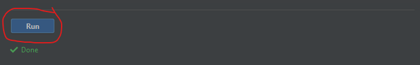
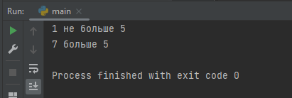

# Введение
## Что такое Python?

Давайте начнем с точного определения того, что такое **Python**. 

**Python** — это компьютерный язык программирования. Или, другими словами, словарь и набор грамматических правил для указания компьютеру выполнять задачи.
Его первоначальный создатель, _Гвидо ван Россум_, назвал его в честь телешоу BBC «Летающий цирк Монти Пайтона». 
Следовательно, вы обнаружите, что книги по Python, примеры кода и документация иногда содержат ссылки на это телешоу.

Считается, что Python прост в изучении, и он разработан на основе набора четко определенных принципов (дзен Python), которые побуждают разработчиков ядра Python создавать язык, который недвусмыслен и прост в использовании.

## Для чего используется Python?

Люди используют Python во многих задачах. Его богатая базовая библиотека делает его превосходным для всех видов небольших вспомогательных скриптов. 
Но он так же хорошо масштабируется и для больших систем. Чтобы проиллюстрировать это, первоначальные создатели YouTube по большей части использовали Python! 
Dropbox, насколько мне известно, в основном тоже написан на Python. А знаете ли вы, что весь бэкэнд и веб-сайт Instagram также написаны на Python?

Python чрезвычайно популярен в быстро развивающейся области знаний, называемой наукой о данных. 
Многие специалисты по данным используют Python для своей повседневной работы. 
И это лишь несколько примеров. Если присмотреться, Python очень вездесущ.

Многие люди говорят, что Python "поставляется с включенными батареями". Это забавный способ заявить, что он включает в себя всеобъемлющую базовую библиотеку. 
В дополнение к этому вы можете найти сотни тысяч внешних пакетов, предоставленных огромным сообществом. 
Вы найдете вспомогательные базовые библиотеки и пакеты практически для всего, чего хотите.

## Основные особенности Python

Так что же делает Python таким популярным языком программирования?

Легко читать и писать
Одной из наиболее примечательных особенностей Python является способ принудительного использования отступов для удобства чтения. 
Без правильного отступа ваш код даже не запустится. В Python нам нужно сделать отступ для всех блоков кода на одном уровне. 
Слева вы можете увидеть пример кода. Если вам хоть немного знаком английский язык, даже не зная синтаксиса языка Python, 
вы сможете получить общее представление о том, что делает этот код. Обратите внимание на отступы.
Если вы еще не понимаете код, не волнуйтесь.

Попробуйте запустить этот код нажав кнопку внизу текста

Обратите внимание на результат вывода в консоли

